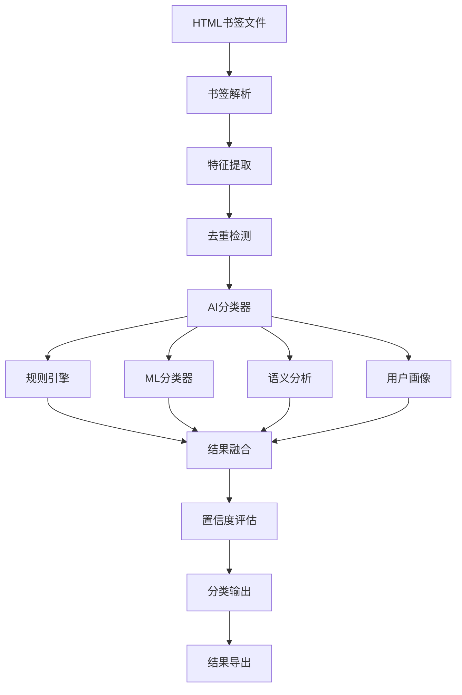

# 系统设计文档

## 1. 总体架构设计

### 1.1 架构概述

AI智能书签分类系统采用分层架构设计，包含以下核心层次：

```
┌─────────────────────────────────────────┐
│              用户界面层                    │
│  CLI交互界面 / Web界面 / API接口          │
├─────────────────────────────────────────┤
│              业务逻辑层                    │
│  书签处理器 / AI分类器 / 数据导出器        │
├─────────────────────────────────────────┤
│              AI算法层                     │
│  规则引擎 / ML分类器 / 语义分析 / 用户画像  │
├─────────────────────────────────────────┤
│              数据访问层                    │
│  配置管理 / 模型存储 / 缓存系统            │
└─────────────────────────────────────────┘
```

### 1.2 核心组件

#### AI分类器 (ai_classifier.py)
- **职责**: 统一的分类接口，集成多种分类方法
- **输入**: URL、标题、内容特征
- **输出**: 分类结果、置信度、推理过程
- **特性**: 多方法融合、缓存优化、学习能力

#### 规则引擎 (rule_engine.py)  
- **职责**: 基于预定义规则的快速分类
- **特性**: 正则表达式预编译、权重计算、动态规则
- **性能**: 亚毫秒级响应时间

#### 机器学习分类器 (ml_classifier.py)
- **职责**: 基于监督学习的智能分类
- **算法**: Random Forest、SVM、Naive Bayes
- **特性**: 在线学习、模型集成、特征工程

#### 书签处理器 (bookmark_processor.py)
- **职责**: 协调整个处理流程
- **功能**: 并行处理、进度跟踪、结果导出
- **优化**: 线程池、批处理、错误恢复

## 2. 数据流设计

### 2.1 处理流程



### 2.2 数据结构

#### 书签特征 (BookmarkFeatures)
```python
@dataclass
class BookmarkFeatures:
    url: str                    # 原始URL
    title: str                  # 标题
    domain: str                 # 域名
    path_segments: List[str]    # 路径段
    query_params: Dict[str, str] # 查询参数
    content_type: str           # 内容类型
    language: str               # 语言
    timestamp: datetime         # 时间戳
```

#### 分类结果 (ClassificationResult)
```python
@dataclass
class ClassificationResult:
    category: str                           # 主分类
    confidence: float                       # 置信度
    subcategory: Optional[str] = None       # 子分类
    reasoning: List[str]                    # 推理过程
    alternatives: List[Tuple[str, float]]   # 备选分类
    processing_time: float                  # 处理时间
    method: str                            # 分类方法
```

## 3. AI算法设计

### 3.1 多方法融合策略

系统采用加权投票的集成方法：

```python
# 权重配置
method_weights = {
    'rule_engine': 0.4,      # 规则引擎 - 40%
    'ml_classifier': 0.3,    # 机器学习 - 30% 
    'semantic_analyzer': 0.2, # 语义分析 - 20%
    'user_profiler': 0.1     # 用户画像 - 10%
}
```

### 3.2 置信度计算

```python
def calculate_confidence(category_scores):
    total_score = sum(category_scores.values())
    best_score = max(category_scores.values())
    confidence = best_score / total_score if total_score > 0 else 0
    
    # 应用置信度提升因子
    if confidence > 0.8:
        confidence = min(1.0, confidence * 1.2)
    
    return confidence
```

### 3.3 学习机制

#### 在线学习
- 从用户反馈中实时学习
- 更新规则权重和ML模型参数
- 维护用户偏好画像

#### 批量学习
- 定期重训练ML模型
- 分析分类错误模式
- 优化规则配置

## 4. 性能优化设计

### 4.1 缓存策略

#### 多层缓存架构
```python
# L1缓存: 特征缓存
feature_cache = LRUCache(maxsize=10000)

# L2缓存: 分类结果缓存  
classification_cache = LRUCache(maxsize=10000)

# L3缓存: 模型预测缓存
ml_prediction_cache = LRUCache(maxsize=5000)
```

#### 缓存失效策略
- 基于时间的TTL失效
- 基于版本的配置失效
- 基于反馈的动态失效

### 4.2 并行处理

#### 线程池设计
```python
with ThreadPoolExecutor(max_workers=n_workers) as executor:
    futures = [executor.submit(classify_bookmark, bookmark) 
              for bookmark in bookmarks]
    
    for future in as_completed(futures):
        result = future.result()
        results.append(result)
```

#### 批处理优化
- 动态批大小调整
- 负载均衡分配
- 内存使用监控

### 4.3 内存管理

#### 对象池模式
```python
class BookmarkPool:
    def __init__(self, size=1000):
        self.pool = [BookmarkFeatures() for _ in range(size)]
        self.available = list(range(size))
    
    def get(self):
        if self.available:
            return self.pool[self.available.pop()]
        return BookmarkFeatures()
```

#### 垃圾回收优化
- 定期清理缓存
- 控制对象生命周期
- 监控内存使用

## 5. 扩展性设计

### 5.1 插件架构

#### 分类器插件接口
```python
class ClassifierPlugin:
    def classify(self, features: BookmarkFeatures) -> Optional[ClassificationResult]:
        """分类接口"""
        raise NotImplementedError
    
    def train(self, training_data: List[Tuple]) -> bool:
        """训练接口"""
        raise NotImplementedError
```

#### 导出器插件接口
```python
class ExporterPlugin:
    def export(self, data: Dict, output_path: str) -> bool:
        """导出接口"""
        raise NotImplementedError
```

### 5.2 配置驱动设计

#### 动态配置加载
```python
class ConfigManager:
    def __init__(self):
        self.watchers = []
        self.config = {}
    
    def watch_config(self, callback):
        """监听配置变化"""
        self.watchers.append(callback)
    
    def reload_config(self):
        """重新加载配置"""
        new_config = self.load_from_file()
        self.notify_watchers(new_config)
```

### 5.3 API设计

#### RESTful API接口
```python
@app.route('/api/classify', methods=['POST'])
def classify_bookmark():
    data = request.json
    result = classifier.classify(data['url'], data['title'])
    return jsonify(result)

@app.route('/api/batch-classify', methods=['POST'])
def batch_classify():
    bookmarks = request.json['bookmarks']
    results = processor.process_batch(bookmarks)
    return jsonify(results)
```

## 6. 质量保证设计

### 6.1 测试策略

#### 测试金字塔
```
           ┌─────────┐
           │ E2E测试  │  <- 5%
           └─────────┘
         ┌─────────────┐
         │  集成测试    │  <- 15%
         └─────────────┘
       ┌─────────────────┐
       │    单元测试      │  <- 80%
       └─────────────────┘
```

#### 测试覆盖率目标
- 核心算法: 95%+
- 业务逻辑: 90%+
- 接口层: 85%+
- 总体覆盖率: 90%+

### 6.2 监控设计

#### 性能指标
```python
metrics = {
    'processing_speed': '45+ bookmarks/sec',
    'classification_accuracy': '92%+',
    'cache_hit_rate': '78%+',
    'memory_usage': '<500MB',
    'response_time': '<100ms'
}
```

#### 告警规则
- 处理速度下降超过20%
- 分类准确率低于85%
- 内存使用超过1GB
- 错误率超过5%

### 6.3 错误处理

#### 异常分类
```python
class BookmarkError(Exception):
    """书签处理异常基类"""
    pass

class ParseError(BookmarkError):
    """解析异常"""
    pass

class ClassificationError(BookmarkError):
    """分类异常"""
    pass

class ConfigError(BookmarkError):
    """配置异常"""
    pass
```

#### 错误恢复策略
- 自动重试机制
- 降级处理方案
- 状态检查点
- 数据备份恢复

## 7. 安全设计

### 7.1 输入验证

#### URL安全检查
```python
def validate_url(url: str) -> bool:
    # 检查协议白名单
    allowed_schemes = ['http', 'https']
    parsed = urlparse(url)
    
    if parsed.scheme not in allowed_schemes:
        return False
    
    # 检查恶意URL模式
    malicious_patterns = [
        r'javascript:',
        r'data:',
        r'file:',
        r'chrome-extension:'
    ]
    
    for pattern in malicious_patterns:
        if re.search(pattern, url, re.IGNORECASE):
            return False
    
    return True
```

### 7.2 数据保护

#### 敏感信息过滤
```python
def sanitize_title(title: str) -> str:
    # 移除可能的敏感信息
    sensitive_patterns = [
        r'password\s*[:=]\s*\w+',
        r'token\s*[:=]\s*\w+',
        r'api[_-]?key\s*[:=]\s*\w+'
    ]
    
    for pattern in sensitive_patterns:
        title = re.sub(pattern, '[REDACTED]', title, flags=re.IGNORECASE)
    
    return title
```

### 7.3 访问控制

#### 资源限制
- 单次处理书签数量限制
- 内存使用上限控制
- 处理时间超时设置
- 并发请求数量限制

## 8. 部署设计

### 8.1 环境配置

#### 开发环境
```yaml
environment: development
debug: true
log_level: DEBUG
cache_size: 1000
max_workers: 2
```

#### 生产环境
```yaml
environment: production  
debug: false
log_level: INFO
cache_size: 10000
max_workers: 8
monitoring: enabled
```

### 8.2 容器化部署

#### Dockerfile设计
```dockerfile
FROM python:3.9-slim

WORKDIR /app
COPY requirements.txt .
RUN pip install -r requirements.txt

COPY . .
EXPOSE 8000

CMD ["python", "main.py", "--api-mode"]
```

### 8.3 监控和日志

#### 日志设计
```python
# 结构化日志
logger.info("书签分类完成", extra={
    'bookmark_count': 1500,
    'processing_time': 30.5,
    'accuracy': 0.92,
    'method': 'ai_classifier'
})
```

#### 指标收集
- Prometheus指标导出
- Grafana可视化面板
- 告警规则配置
- 性能趋势分析

---

这个设计文档涵盖了系统的核心架构、算法设计、性能优化、扩展性、质量保证、安全和部署等各个方面，为系统的开发和维护提供了完整的技术指导。